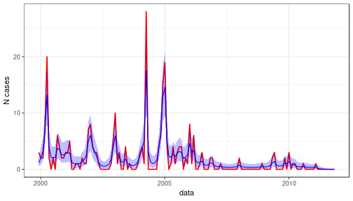

# Statistical model used

The idea is to fit an inhomogeneous zero-inflated Poisson dynamics in discrete time.
The expected size of the population of infected people is the single state variable,
which has a growth that can change at each time step. The number of infected people at
each time step follows a Poisson distribution where its single parameters is the expected number of cases.
The number of recorded cases is a proportion of the number of infected people.

This model thus describe the number of observed cases as a zero-inflated Poisson variable,
that evolve in time (that is , inhomogeneous in time). Our purpose with this model is
to provide a time series of expected number of cases with minimal assumptions. 
By replacing the original time series of observed cases with this estimated time series can have two main
advantages:

- Zero values are eliminated, as they are replaced by the expected numbers (the estimated time-varying parameter of the Poisson).
- Observation (including detection errors that can explain part of the zeroes) and part of prcess errors are sorted out.


## Model specification:

##### Number of infected people in the population: 

   * E[N(t+1)] =  N(t) exp(r(t))
   * N(t) ~ Poisson(lambda = E[N(t)])

##### Number of cases detected :

   * n(t) ~ Binomial(P(t), N(t))

##### Where:

* E[X] expected values
* r(t) a time-varying rate of change
* P is the proportion of detected cases


## Model script

The model is a discrete time dynamics, fitted by the a bayesian MCMC routine
using the [JAGS](http://www.uvm.edu/~bbeckage/Teaching/DataAnalysis/Manuals/manual.jags.pdf), language with the R packages
[rjags](https://cran.r-project.org/package=rjags) e [R2jags](https://cran.r-project.org/package=R2jags).

The model script in Jags is [here](poisson_model.jag). 


# Monthly data

* Number of Malaria cases in Tartagal, Salta, from 12/1999 to 
11/2011
* Time series length: 144 months
* Total number of cases: 266


## Model settings


The model was fitted in parallel with a separated R script, because it is time-consuming.

* Number of chains: 4
* Number of iterations in each chain: 1000000
* Burn-in period (n iterations discarded): 500000
* Thinning period: 500
* Number of values of the posterior distribution kept in each interaction: 1000
* Total number of values of posterior kept: 4000


## Model Convergence

Convergence ok: 

* R-hat statistics of estimated posterior parameters ranged from 1.0005 
to 1.047
* Effective size of samples of posterior distributions ranged from 850 
to 850


## Estimated detection probability

The posterior mean detection probability is
0.158.

The plot of posterior density of the four chains pooled is above:


## Observed x predicted number of cases

The plot shows the expected value of the number of cases recorded and
its credible interval (blue) and the observed number of cases (red).



## Files

* [R script](cluster_months.R) (ran in a separate machine in parallel)
* [R binary file](fit1.RData) with the object of the fitted model (class rjags). 
* [Fitted expected number of cases](predicted_cases_poisson_model_monthly.csv): time series of the mean of posterior distributions. Comma-delimited (csv)


# Weekly data

* Same dataset, but aggregated by epidemiological week.
* Time series length: 624 weeks


## Model settings


The model was fitted in parallel with a separated R script, because it is time-consuming.

* Number of chains: 4
* Number of iterations in each chain: 3000000
* Burn-in period (n iterations discarded): 1500000
* Thinning period: 1500
* Number of values of the posterior distribution kept in each interaction: 1000
* Total number of values of posterior kept: 4000


## Model Convergence

Convergence ok: 

* R-hat statistics of estimated posterior parameters ranged from 1.0005 
to 1.2877
* Effective size of samples of posterior distributions ranged from 560 
to 560

The posterior mean detection probability is
0.158.

## Estimated detection probability

The posterior mean detection probability is very low:
0.0112.

Because this detection is constant, I do not think it will affect
the smoothing of predicted number of cases itself, only teh magnitude of the predicted values.
So, I suppose that's ok to use in CCM, right?

The plot of posterior density of the four chains pooled is below.


## Observed x predicted number of cases

The plot shows the expected value of the number of cases recorded and
its credible interval (blue) and the observed number of cases (red).


```
##         [,1] [,2] [,3] [,4] [,5] [,6] [,7] [,8] [,9] [,10] [,11] [,12] [,13] [,14] [,15]
##         [,16] [,17] [,18] [,19] [,20] [,21] [,22] [,23] [,24] [,25] [,26] [,27] [,28]
##         [,29] [,30] [,31] [,32] [,33] [,34] [,35] [,36] [,37] [,38] [,39] [,40] [,41]
##         [,42] [,43] [,44] [,45] [,46] [,47] [,48] [,49] [,50] [,51] [,52] [,53] [,54]
##         [,55] [,56] [,57] [,58] [,59] [,60] [,61] [,62] [,63] [,64] [,65] [,66] [,67]
##         [,68] [,69] [,70] [,71] [,72] [,73] [,74] [,75] [,76] [,77] [,78] [,79] [,80]
##         [,81] [,82] [,83] [,84] [,85] [,86] [,87] [,88] [,89] [,90] [,91] [,92] [,93]
##         [,94] [,95] [,96] [,97] [,98] [,99] [,100] [,101] [,102] [,103] [,104] [,105]
##         [,106] [,107] [,108] [,109] [,110] [,111] [,112] [,113] [,114] [,115] [,116]
##         [,117] [,118] [,119] [,120] [,121] [,122] [,123] [,124] [,125] [,126] [,127]
##         [,128] [,129] [,130] [,131] [,132] [,133] [,134] [,135] [,136] [,137] [,138]
##         [,139] [,140] [,141] [,142] [,143] [,144] [,145] [,146] [,147] [,148] [,149]
##         [,150] [,151] [,152] [,153] [,154] [,155] [,156] [,157] [,158] [,159] [,160]
##         [,161] [,162] [,163] [,164] [,165] [,166] [,167] [,168] [,169] [,170] [,171]
##         [,172] [,173] [,174] [,175] [,176] [,177] [,178] [,179] [,180] [,181] [,182]
##         [,183] [,184] [,185] [,186] [,187] [,188] [,189] [,190] [,191] [,192] [,193]
##         [,194] [,195] [,196] [,197] [,198] [,199] [,200] [,201] [,202] [,203] [,204]
##         [,205] [,206] [,207] [,208] [,209] [,210] [,211] [,212] [,213] [,214] [,215]
##         [,216] [,217] [,218] [,219] [,220] [,221] [,222] [,223] [,224] [,225] [,226]
##         [,227] [,228] [,229] [,230] [,231] [,232] [,233] [,234] [,235] [,236] [,237]
##         [,238] [,239] [,240] [,241] [,242] [,243] [,244] [,245] [,246] [,247] [,248]
##         [,249] [,250] [,251] [,252] [,253] [,254] [,255] [,256] [,257] [,258] [,259]
##         [,260] [,261] [,262] [,263] [,264] [,265] [,266] [,267] [,268] [,269] [,270]
##         [,271] [,272] [,273] [,274] [,275] [,276] [,277] [,278] [,279] [,280] [,281]
##         [,282] [,283] [,284] [,285] [,286] [,287] [,288] [,289] [,290] [,291] [,292]
##         [,293] [,294] [,295] [,296] [,297] [,298] [,299] [,300] [,301] [,302] [,303]
##         [,304] [,305] [,306] [,307] [,308] [,309] [,310] [,311] [,312] [,313] [,314]
##         [,315] [,316] [,317] [,318] [,319] [,320] [,321] [,322] [,323] [,324] [,325]
##         [,326] [,327] [,328] [,329] [,330] [,331] [,332] [,333] [,334] [,335] [,336]
##         [,337] [,338] [,339] [,340] [,341] [,342] [,343] [,344] [,345] [,346] [,347]
##         [,348] [,349] [,350] [,351] [,352] [,353] [,354] [,355] [,356] [,357] [,358]
##         [,359] [,360] [,361] [,362] [,363] [,364] [,365] [,366] [,367] [,368] [,369]
##         [,370] [,371] [,372] [,373] [,374] [,375] [,376] [,377] [,378] [,379] [,380]
##         [,381] [,382] [,383] [,384] [,385] [,386] [,387] [,388] [,389] [,390] [,391]
##         [,392] [,393] [,394] [,395] [,396] [,397] [,398] [,399] [,400] [,401] [,402]
##         [,403] [,404] [,405] [,406] [,407] [,408] [,409] [,410] [,411] [,412] [,413]
##         [,414] [,415] [,416] [,417] [,418] [,419] [,420] [,421] [,422] [,423] [,424]
##         [,425] [,426] [,427] [,428] [,429] [,430] [,431] [,432] [,433] [,434] [,435]
##         [,436] [,437] [,438] [,439] [,440] [,441] [,442] [,443] [,444] [,445] [,446]
##         [,447] [,448] [,449] [,450] [,451] [,452] [,453] [,454] [,455] [,456] [,457]
##         [,458] [,459] [,460] [,461] [,462] [,463] [,464] [,465] [,466] [,467] [,468]
##         [,469] [,470] [,471] [,472] [,473] [,474] [,475] [,476] [,477] [,478] [,479]
##         [,480] [,481] [,482] [,483] [,484] [,485] [,486] [,487] [,488] [,489] [,490]
##         [,491] [,492] [,493] [,494] [,495] [,496] [,497] [,498] [,499] [,500] [,501]
##         [,502] [,503] [,504] [,505] [,506] [,507] [,508] [,509] [,510] [,511] [,512]
##         [,513] [,514] [,515] [,516] [,517] [,518] [,519] [,520] [,521] [,522] [,523]
##         [,524] [,525] [,526] [,527] [,528] [,529] [,530] [,531] [,532] [,533] [,534]
##         [,535] [,536] [,537] [,538] [,539] [,540] [,541] [,542] [,543] [,544] [,545]
##         [,546] [,547] [,548] [,549] [,550] [,551] [,552] [,553] [,554] [,555] [,556]
##         [,557] [,558] [,559] [,560] [,561] [,562] [,563] [,564] [,565] [,566] [,567]
##         [,568] [,569] [,570] [,571] [,572] [,573] [,574] [,575] [,576] [,577] [,578]
##         [,579] [,580] [,581] [,582] [,583] [,584] [,585] [,586] [,587] [,588] [,589]
##         [,590] [,591] [,592] [,593] [,594] [,595] [,596] [,597] [,598] [,599] [,600]
##         [,601] [,602] [,603] [,604] [,605] [,606] [,607] [,608] [,609] [,610] [,611]
##         [,612] [,613] [,614] [,615] [,616] [,617] [,618] [,619] [,620] [,621] [,622]
##         [,623]
##  [ reached getOption("max.print") -- omitted 2000 rows ]
```


## Files

* [R script](cluster.R) (ran in a separate machine in parallel)
* [R binary file](fit2.RData) with the object of the fitted model (class rjags). 
* [Fitted expected number of cases](predicted_cases_poisson_model_weekly.csv): time series of the mean of posterior distributions. Comma-delimited (csv)

